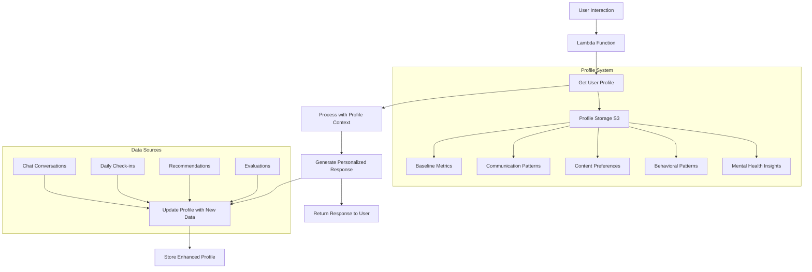

# 🧠 Mental Health Chatbot Agent

[](https://streamlit.io/)
[](https://aws.amazon.com/)
[](https://python.org/)
[](LICENSE)

A comprehensive mental health support agent. This agent provides empathetic conversation, daily check-ins, mental health evaluation, personalized recommendations, and proactive check-in scheduling.

Online App can be accessed: 
https://mentalhealthagent-qhsvdfgec2jvfsj4faqbqg.streamlit.app/

## 🌟 Features

- 💬 **Empathetic Chat** - AI-powered conversations with emotional support
- 📊 **Daily Check-ins** - Structured mental health questionnaires
- 📈 **Health Evaluation** - Quantitative analysis of mental health trends
- 🎯 **Personalized Recommendations** - Tailored content and activities
- ⏰ **Proactive Companions** - Intelligent scheduling of check-ins
- 🔒 **Privacy-First** - Secure data handling and user confidentiality
- ☁️ **Cloud-Ready** - Deploy to Streamlit Cloud or AWS infrastructure

## 🚀 Quick Start

**For immediate testing:**
```bash
# 1. Clone the repository
git clone https://github.com/Silei-Silei/Mental_Health_Agent.git
cd Mental_Health_Agent

# 2. Install dependencies
pip install -r requirements.txt

# 3. Run the playground (requires api provided first)
streamlit run streamlit_playground.py
```

## 🧠 Overview

The Mental Health Agent is designed to be a supportive companion that:
1. **Chats** - Provides empathetic conversation and emotional support
2. **Daily Check-ins** - Collects mental health status through structured questionnaires
3. **Evaluates** - Quantitatively assesses mental health situation using data analysis
4. **Recommends** - Suggests personalized content (videos, exercises, activities) based on needs
5. **Schedules** - Proactively schedules check-ins based on mental health status
6. **Remembers** - Maintains user profiles for enhanced personalization and continuity of care

### 🔄 Data Flow with User Profiles

The system now includes intelligent user profiling that enhances every interaction:



**Key Benefits of User Profiles:**
- **Personalized Responses**: Chat responses adapt to user's communication style and emotional patterns
- **Baseline Awareness**: Evaluations compare against personal historical data, not generic averages
- **Smart Recommendations**: Content suggestions improve over time based on user preferences and effectiveness
- **Continuity of Care**: Follow-up suggestions use historical context and patterns
- **Adaptive Scheduling**: Check-in frequency adjusts based on user engagement and mental health trends

## 🏗️ Architecture
- **API Contract**: `agent/openapi.yaml` defines the endpoints
- **Lambda Functions**: `lambdas/` contains the business logic
- **Infrastructure**: `infra/` has AWS IAM policies and trust relationships
- **Client Scripts**: `scripts/` provides CLI interface
- **Playground**: `streamlit_playground.py` offers a web interface for testing
- **Deployment Scripts**: Automated deployment and configuration scripts

## 📁 Project Structure

```
Mental_Health_Agent/
├── .github/
│   └── workflows/
│       └── ci.yml                # GitHub Actions CI/CD pipeline
├── .streamlit/
│   └── config.toml               # Streamlit configuration
├── agent/
│   └── openapi.yaml              # API contract definition
├── infra/
│   ├── lambda_trust.json         # IAM trust policy for Lambda
│   └── lambda_bucket_policy.json # S3 bucket access policy
├── lambdas/
│   ├── mh_chat_handler.py        # Chat functionality
│   ├── mh_daily_checkin.py       # Daily check-in processing
│   ├── mh_evaluate_mental_health.py # Mental health evaluation
│   ├── mh_recommendations.py     # Personalized recommendations
│   ├── mh_schedule_checkin.py    # Companion scheduling
│   ├── mh_user_profile.py        # User profile management
│   └── profile_utils.py          # Shared profile utilities
├── scripts/
│   └── invoke_mental_health_agent.py # CLI interface
├── tests/
│   ├── __init__.py               # Test package
│   └── test_api.py                # API tests
├── add_api_routes.sh             # API Gateway route configuration
├── CONTRIBUTING.md               # Contribution guidelines
├── DEPLOYMENT_CLOUD.md           # Cloud deployment instructions
├── LICENSE                        # MIT License
├── README.md                      # Project documentation
├── deploy_lambdas.sh             # Lambda deployment script
├── requirements.txt              # Python dependencies
├── run.sh                        # Environment setup and testing
├── setup.py                      # Python package setup
├── streamlit_app.py              # Streamlit Cloud deployment version
└── streamlit_playground.py       # Web-based testing interface
```

## 🛡️ Security & Privacy

- All data is encrypted in transit and at rest
- User data is stored securely in S3 with proper access controls
- No personal information is logged or shared
- Mental health data is treated with the highest confidentiality
  
## ⚠️ Disclaimer

This agent is designed for general mental health support and should not replace professional mental health care. Users experiencing severe mental health issues should seek help from qualified professionals.

## 📝 License

This project is provided as-is for educational and development purposes.
