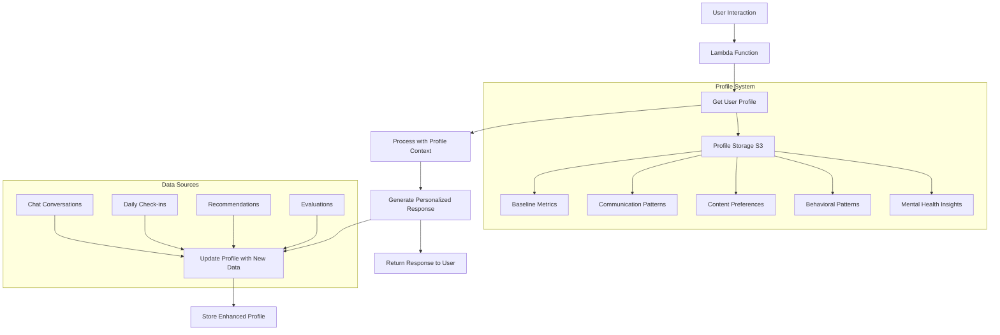

# 🧠 Mental Health Chatbot Agent

[](https://streamlit.io/)
[](https://aws.amazon.com/)
[](https://python.org/)
[](LICENSE)

A comprehensive mental health support system built with AWS Bedrock and Lambda functions. This agent provides empathetic conversation, daily check-ins, mental health evaluation, personalized recommendations, and proactive check-in scheduling.


## 🌟 Features

- 💬 **Empathetic Chat** - AI-powered conversations with emotional support
- 📊 **Daily Check-ins** - Structured mental health questionnaires
- 📈 **Health Evaluation** - Quantitative analysis of mental health trends
- 🎯 **Personalized Recommendations** - Tailored content and activities
- ⏰ **Proactive Companions** - Intelligent scheduling of check-ins
- 🔒 **Privacy-First** - Secure data handling and user confidentiality
- ☁️ **Cloud-Ready** - Deploy to Streamlit Cloud or AWS infrastructure

## 🚀 Quick Start

**For immediate testing:**
```bash
# 1. Clone the repository
git clone <your-repo-url>
cd Mental_Health_Agent

# 2. Install dependencies
pip install -r requirements.txt

# 3. Run the playground (requires AWS deployment first)
streamlit run streamlit_playground.py
```

**For full deployment, see the [Deployment Guide](#-deployment-guide) below.**

**For instant public access, see [Cloud Deployment](#-cloud-deployment-options) below.**

## 🧠 Overview

The Mental Health Agent is designed to be a supportive companion that:
1. **Chats** - Provides empathetic conversation and emotional support
2. **Daily Check-ins** - Collects mental health status through structured questionnaires
3. **Evaluates** - Quantitatively assesses mental health situation using data analysis
4. **Recommends** - Suggests personalized content (videos, exercises, activities) based on needs
5. **Schedules** - Proactively schedules check-ins based on mental health status
6. **Remembers** - Maintains user profiles for enhanced personalization and continuity of care

### 🔄 Data Flow with User Profiles

The system now includes intelligent user profiling that enhances every interaction:



**Key Benefits of User Profiles:**
- **Personalized Responses**: Chat responses adapt to user's communication style and emotional patterns
- **Baseline Awareness**: Evaluations compare against personal historical data, not generic averages
- **Smart Recommendations**: Content suggestions improve over time based on user preferences and effectiveness
- **Continuity of Care**: Follow-up suggestions use historical context and patterns
- **Adaptive Scheduling**: Check-in frequency adjusts based on user engagement and mental health trends

## 🏗️ Architecture
- **API Contract**: `agent/openapi.yaml` defines the endpoints
- **Lambda Functions**: `lambdas/` contains the business logic
- **Infrastructure**: `infra/` has AWS IAM policies and trust relationships
- **Client Scripts**: `scripts/` provides CLI interface
- **Playground**: `streamlit_playground.py` offers a web interface for testing
- **Deployment Scripts**: Automated deployment and configuration scripts

## 📁 Project Structure

```
Mental_Health_Agent/
├── .github/
│   └── workflows/
│       └── ci.yml                # GitHub Actions CI/CD pipeline
├── .streamlit/
│   └── config.toml               # Streamlit configuration
├── agent/
│   └── openapi.yaml              # API contract definition
├── infra/
│   ├── lambda_trust.json         # IAM trust policy for Lambda
│   └── lambda_bucket_policy.json # S3 bucket access policy
├── lambdas/
│   ├── mh_chat_handler.py        # Chat functionality
│   ├── mh_daily_checkin.py       # Daily check-in processing
│   ├── mh_evaluate_mental_health.py # Mental health evaluation
│   ├── mh_recommendations.py     # Personalized recommendations
│   ├── mh_schedule_checkin.py    # Companion scheduling
│   ├── mh_user_profile.py        # User profile management
│   └── profile_utils.py          # Shared profile utilities
├── scripts/
│   └── invoke_mental_health_agent.py # CLI interface
├── tests/
│   ├── __init__.py               # Test package
│   └── test_api.py                # API tests
├── add_api_routes.sh             # API Gateway route configuration
├── CONTRIBUTING.md               # Contribution guidelines
├── DEPLOYMENT_CLOUD.md           # Cloud deployment instructions
├── LICENSE                        # MIT License
├── README.md                      # Project documentation
├── deploy_lambdas.sh             # Lambda deployment script
├── requirements.txt              # Python dependencies
├── run.sh                        # Environment setup and testing
├── setup.py                      # Python package setup
├── streamlit_app.py              # Streamlit Cloud deployment version
└── streamlit_playground.py       # Web-based testing interface
```

## 🌐 Cloud Deployment Options

**Want to share your Mental Health Agent without requiring others to deploy AWS infrastructure?**

### Option 1: Streamlit Cloud (Recommended)
Deploy to Streamlit Cloud for instant public access:

1. **Push to GitHub**:
   ```bash
   git add .
   git commit -m "Add Streamlit Cloud deployment"
   git push origin main
   ```

2. **Deploy to Streamlit Cloud**:
   - Go to [share.streamlit.io](https://share.streamlit.io/)
   - Connect your GitHub repository
   - Select `streamlit_app.py` as main file
   - Set environment variables: `API_BASE` and `MH_BUCKET`
   - Deploy!

3. **Share the URL**: `https://your-app.streamlit.app`

**Benefits**: Free hosting, instant access, no AWS setup required for users

### Option 2: Other Cloud Platforms
- **Heroku**: `streamlit_app.py` + `Procfile`
- **Railway**: Auto-detect Python, set env vars
- **Render**: Web service with build/start commands
- **Google Cloud Run**: Containerized deployment

### Option 3: Public API
Make your API Gateway publicly accessible:
- Remove API key requirements
- Enable CORS
- Add rate limiting
- Share API URL: `https://your-api.execute-api.region.amazonaws.com`

**See [DEPLOYMENT_CLOUD.md](DEPLOYMENT_CLOUD.md) for detailed instructions.**

## 🚀 Deployment Guide

This section provides step-by-step instructions for deploying the Mental Health Agent to AWS.

### Prerequisites

1. **AWS Account** with appropriate permissions
2. **AWS CLI** installed and configured
3. **Python 3.9+** installed
4. **Node.js** (for API Gateway deployment tools)

### Step 1: AWS Setup

1. **Create S3 Bucket**:
   ```bash
   aws s3 mb s3://your-mental-health-agent-bucket
   ```

2. **Create IAM Role** for Lambda functions:
   ```bash
   aws iam create-role --role-name MentalHealthAgentRole --assume-role-policy-document file://infra/lambda_trust.json
   aws iam put-role-policy --role-name MentalHealthAgentRole --policy-name S3BucketAccess --policy-document file://infra/lambda_bucket_policy.json
   ```

3. **Attach Bedrock Permissions**:
   ```bash
   aws iam attach-role-policy --role-name MentalHealthAgentRole --policy-arn arn:aws:iam::aws:policy/AmazonBedrockFullAccess
   ```

### Step 2: Deploy Lambda Functions

1. **Install Dependencies**:
   ```bash
   pip install -r requirements.txt
   ```

2. **Deploy All Functions**:
   ```bash
   chmod +x deploy_lambdas.sh
   ./deploy_lambdas.sh
   ```

   This script will:
   - Package each Lambda function with dependencies
   - Deploy to AWS Lambda with proper IAM roles
   - Set up environment variables (MH_BUCKET)
   - Configure timeout and memory settings
   - Handle all 5 Lambda functions automatically

**What the script does:**
- Creates deployment packages for each Lambda function
- Uses the IAM role created in Step 1
- Sets up proper environment variables
- Handles AWS region configuration
- Provides error handling and status updates

### Step 3: Create API Gateway

1. **Create HTTP API**:
   ```bash
   aws apigatewayv2 create-api --name mental-health-agent-api --protocol-type HTTP --target arn:aws:lambda:us-west-2:YOUR_ACCOUNT_ID:function:mh-chat-handler
   ```

2. **Add API Routes**:
   ```bash
   chmod +x add_api_routes.sh
   ./add_api_routes.sh
   ```

   This script will:
   - Create integrations for each Lambda function
   - Set up all 5 API routes (/chat, /daily-checkin, etc.)
   - Grant API Gateway permission to invoke Lambda functions
   - Handle HTTP API Gateway configuration

3. **Deploy API**:
   ```bash
   aws apigatewayv2 create-deployment --api-id YOUR_API_ID --stage-name prod
   ```

**What the script does:**
- Creates Lambda integrations for each endpoint
- Sets up POST routes for all 5 functions
- Configures proper permissions for API Gateway
- Handles error cases and provides feedback

### Step 4: Configure Environment

1. **Set Environment Variables**:
   ```bash
   export API_BASE=https://YOUR_API_ID.execute-api.us-west-2.amazonaws.com
   export MH_BUCKET=your-mental-health-agent-bucket
   ```

2. **Update Configuration**:
   - Update `streamlit_playground.py` with your API Gateway URL
   - Update `run.sh` with your bucket name

### Step 5: Test Deployment

1. **Use the Test Script**:
   ```bash
   chmod +x run.sh
   ./run.sh
   ```

   This script will:
   - Set up environment variables automatically
   - Test all API endpoints
   - Run the Streamlit playground
   - Provide debugging information

2. **Manual Testing**:
   ```bash
   # Test individual endpoints
   python scripts/invoke_mental_health_agent.py chat --user-id "test_user" --message "Hello"
   python scripts/invoke_mental_health_agent.py daily-checkin --user-id "test_user" --checkin-type "morning"
   python scripts/invoke_mental_health_agent.py evaluate --user-id "test_user" --evaluation-period "week"
   ```

3. **Run Playground**:
   ```bash
   streamlit run streamlit_playground.py
   ```

4. **Verify All Functions**:
   - Chat functionality
   - Daily check-in processing
   - Mental health evaluation
   - Recommendation generation
   - Companion scheduling

**What run.sh does:**
- Automatically sets API_BASE and MH_BUCKET environment variables
- Tests all 5 API endpoints with sample data
- Launches the Streamlit playground
- Provides helpful debugging output

### Step 6: Production Considerations

1. **Custom Domain** (Optional):
   ```bash
   aws apigatewayv2 create-domain-name --domain-name your-domain.com --domain-name-configurations CertificateArn=YOUR_CERT_ARN
   ```

2. **Monitoring Setup**:
   - Enable CloudWatch logging
   - Set up alarms for errors
   - Monitor API Gateway metrics

3. **Security Hardening**:
   - Enable API key authentication
   - Set up CORS policies
   - Implement rate limiting

### Troubleshooting

**Common Issues:**

1. **Lambda Permission Errors**:
   ```bash
   aws lambda add-permission --function-name mh-chat-handler --statement-id apigateway-invoke --action lambda:InvokeFunction --principal apigateway.amazonaws.com
   ```

2. **API Gateway 404 Errors**:
   - Verify API Gateway routes are created
   - Check Lambda function names match
   - Ensure API Gateway has permission to invoke Lambda

3. **S3 Access Denied**:
   - Verify bucket policy allows Lambda access
   - Check IAM role has S3 permissions
   - Ensure bucket name is correct

**Debug Commands:**
```bash
# Check Lambda functions
aws lambda list-functions --query 'Functions[?contains(FunctionName, `mh-`)].{Name:FunctionName,State:State}'

# Check API Gateway routes
aws apigatewayv2 get-routes --api-id YOUR_API_ID

# Test Lambda directly
aws lambda invoke --function-name mh-chat-handler --payload '{"user_id":"test","message":"hello"}' response.json
```

### Cost Optimization

- **Lambda**: Use appropriate memory allocation (128MB-512MB)
- **API Gateway**: Monitor request volume and costs
- **S3**: Use lifecycle policies for old data
- **Bedrock**: Monitor token usage and costs

## 📋 API Endpoints

### 1. `/chat` - General Conversation
Provides empathetic conversation and emotional support.

**Request:**
```json
{
  "user_id": "user123",
  "message": "I'm feeling overwhelmed with work lately",
  "mood_context": {
    "current_mood": "stressed",
    "stress_level": 8
  }
}
```

**Response:**
```json
{
  "response": "I understand you're feeling overwhelmed. That's completely valid...",
  "suggestions": ["Take some deep breaths", "Consider talking to a trusted friend"],
  "follow_up_questions": ["Would you like to talk more about what's on your mind?"],
  "mood_detected": "stressed",
  "conversation_id": "conv_20240115_120000_ab12cd"
}
```

### 2. `/daily-checkin` - Mental Health Check-in
Collects structured mental health data through questionnaires.

**Request:**
```json
{
  "user_id": "user123",
  "checkin_type": "morning",
  "responses": {
    "mood_rating": 6,
    "energy_level": 5,
    "sleep_quality": 7,
    "stress_level": 6,
    "anxiety_level": 4,
    "social_connection": 7,
    "productivity": 6,
    "gratitude": "Having a good cup of coffee",
    "challenges": "Work presentation tomorrow",
    "goals": "Finish the presentation"
  }
}
```

**Response:**
```json
{
  "checkin_id": "checkin_20240115_120000_ab12cd",
  "message": "Thank you for checking in! You're taking important steps...",
  "insights": "You're doing well overall! Your wellness score is strong.",
  "recommendations": ["Try some deep breathing exercises", "Consider taking a 10-minute break"],
  "next_checkin_suggested": "Tomorrow at the same time (09:00)"
}
```

### 3. `/evaluate-mental-health` - Mental Health Evaluation
Analyzes user's mental health data to provide quantitative assessment.

**Request:**
```json
{
  "user_id": "user123",
  "evaluation_period": "week",
  "include_chat_analysis": true,
  "include_checkin_data": true
}
```

**Response:**
```json
{
  "evaluation_id": "eval_20240115_120000_ab12cd",
  "overall_score": 65.5,
  "mood_trend": "stable",
  "stress_level": "moderate",
  "risk_factors": ["high_stress"],
  "strengths": ["gratitude_practice", "goal_oriented"],
  "recommendations": ["Practice daily relaxation techniques", "Consider regular check-ins"],
  "follow_up_needed": false,
  "next_evaluation_date": "2024-01-22"
}
```

### 4. `/recommendations` - Personalized Recommendations
Provides tailored recommendations based on mental health status and preferences.

**Request:**
```json
{
  "user_id": "user123",
  "recommendation_type": "stress_relief",
  "current_mood": "anxious",
  "preferences": {
    "content_types": ["video", "audio"],
    "duration": "short",
    "activity_level": "low"
  },
  "urgency_level": "high"
}
```

**Response:**
```json
{
  "recommendation_id": "rec_20240115_120000_ab12cd",
  "recommendations": [
    {
      "title": "4-7-8 Breathing Technique",
      "type": "interactive",
      "description": "Simple breathing pattern to reduce anxiety and stress",
      "url": "https://example.com/478-breathing",
      "duration": "3 minutes",
      "difficulty": "beginner",
      "mood_benefit": "anxiety reduction",
      "priority": "high"
    }
  ],
  "personalized_message": "Feeling anxious can be overwhelming. These gentle activities...",
  "follow_up_suggestions": ["Try one of these recommendations right now", "Set a reminder to check in with yourself"]
}
```

### 5. `/schedule-checkin` - Schedule Proactive Check-ins
Determines when to proactively check in based on mental health status.

**Request:**
```json
{
  "user_id": "user123",
  "mental_health_score": 35,
  "risk_level": "high",
  "user_preferences": {
    "preferred_checkin_times": ["09:00", "18:00"],
    "max_checkins_per_week": 5,
    "notification_methods": ["push", "email"]
  },
  "last_checkin_date": "2024-01-15T09:00:00Z"
}
```

**Response:**
```json
{
  "schedule_id": "schedule_20240115_120000_ab12cd",
  "next_checkin_date": "2024-01-16T09:00:00Z",
  "checkin_frequency": "daily",
  "reasoning": "Your mental health score indicates you need more frequent support...",
  "notification_scheduled": true,
  "message": "I'm concerned about how you're feeling right now..."
}
```

## 🚀 Getting Started

### Prerequisites
- AWS CLI configured
- Python 3.8+
- AWS Bedrock access
- S3 bucket for data storage

### Environment Variables
```bash
export AWS_REGION=us-east-1
export MH_BUCKET=mental-health-agent
export API_BASE=https://your-api-gateway-url.amazonaws.com/prod
export AGENT_ID=your-bedrock-agent-id
export AGENT_ALIAS_ID=your-agent-alias-id
```

### Installation
1. Clone the repository
2. Install dependencies:
   ```bash
   pip install boto3 requests streamlit
   ```

### Using the CLI Script
```bash
# Chat with the agent
python scripts/invoke_mental_health_agent.py chat \
  --user-id "user123" \
  --message "I'm feeling stressed today"

# Perform daily check-in
python scripts/invoke_mental_health_agent.py checkin \
  --user-id "user123" \
  --mood-rating 6 \
  --stress-level 7 \
  --gratitude "Having supportive friends"

# Get mental health evaluation
python scripts/invoke_mental_health_agent.py evaluate \
  --user-id "user123" \
  --evaluation-period "week"

# Get personalized recommendations
python scripts/invoke_mental_health_agent.py recommendations \
  --user-id "user123" \
  --recommendation-type "stress_relief" \
  --current-mood "anxious"

# Schedule proactive check-ins
python scripts/invoke_mental_health_agent.py schedule \
  --user-id "user123" \
  --mental-health-score 35 \
  --risk-level "high"
```

### Using the Streamlit Playground
```bash
streamlit run streamlit_playground.py
```

## 🔧 Lambda Functions

### 1. `mh_chat_handler.py`
- Handles general conversation and emotional support
- Uses Bedrock Claude for empathetic responses
- Stores conversation history in S3
- Detects mood from user messages

### 2. `mh_daily_checkin.py`
- Processes structured mental health questionnaires
- Calculates wellness scores and identifies concerns
- Generates insights and immediate recommendations
- Suggests next check-in timing

### 3. `mh_evaluate_mental_health.py`
- Analyzes historical mental health data
- Calculates overall mental health scores (0-100)
- Identifies trends, risk factors, and strengths
- Generates personalized recommendations

### 4. `mh_recommendations.py`
- Provides personalized content recommendations
- Includes funny videos, yoga, meditation, breathing exercises
- Matches content to user preferences and current needs
- Generates encouraging messages

### 5. `mh_schedule_checkin.py`
- Determines optimal check-in frequency based on mental health status
- Respects user preferences for timing and frequency
- Schedules notifications for proactive support
- Adapts to user's historical patterns

### 6. `mh_user_profile.py` (NEW)
- Manages user profiles for enhanced personalization
- Provides user-specific context and insights
- Handles profile creation, updates, and retrieval
- Supports multiple profile operations (get_profile, get_insights, get_context, etc.)

### 7. `profile_utils.py` (NEW)
- Shared utility functions for profile management
- Profile creation, updates, and analysis
- Integration with existing Lambda functions
- Personalized context generation for different use cases

## 📊 Data Storage

The agent stores data in S3 with the following structure:
```
mental-health-agent/
├── conversations/
│   └── {user_id}/
│       └── {conversation_id}.json
├── checkins/
│   └── {user_id}/
│       └── {checkin_id}.json
├── evaluations/
│   └── {user_id}/
│       └── {evaluation_id}.json
├── recommendations/
│   └── {user_id}/
│       └── {recommendation_id}.json
├── schedules/
│   └── {user_id}/
│       └── {schedule_id}.json
├── profiles/                    # NEW: User profiles
│   └── {user_id}/
│       └── profile.json
└── users/
    └── {user_id}/
        ├── checkin_history.json
        └── schedule_history.json
```

## 🧠 User Profile System (NEW)

The mental health agent now includes an intelligent user profiling system that learns and adapts to each user's unique patterns and preferences.

### Profile Components

**Mental Health Baseline**
- Average mood, stress, energy, sleep, and anxiety levels
- Typical concerns and identified strengths
- Personal baseline metrics for comparison

**Communication Patterns**
- Preferred response style and conversation frequency
- Common emotional states and effective coping strategies
- Communication preferences and patterns

**Content Preferences**
- Preferred content types (video, audio, text, interactive)
- Effective vs. ineffective recommendations
- Duration and activity level preferences

**Behavioral Patterns**
- Check-in consistency and engagement level
- Preferred timing and response patterns
- User interaction history

**Mental Health Insights**
- Risk factors and protective factors
- Triggers and warning signs
- Trend analysis and evaluation history

### Profile Benefits

- **Personalized Responses**: Chat responses adapt to user's communication style
- **Baseline Awareness**: Evaluations compare against personal historical data
- **Smart Recommendations**: Content suggestions improve based on user preferences
- **Continuity of Care**: Follow-up suggestions use historical context
- **Adaptive Scheduling**: Check-in frequency adjusts based on user patterns

### Profile API Endpoints

- `POST /user-profile` - Profile management operations
  - `get_profile` - Retrieve user profile
  - `get_insights` - Get profile insights and analysis
  - `get_context` - Get personalized context for specific use cases
  - `update_from_checkin` - Update profile from check-in data
  - `update_from_chat` - Update profile from chat data
  - `update_from_recommendations` - Update profile from recommendation interactions
  - `update_from_evaluation` - Update profile from evaluation results
  - `update_demographics` - Update demographic information

## 🛡️ Security & Privacy

- All data is encrypted in transit and at rest
- User data is stored securely in S3 with proper access controls
- No personal information is logged or shared
- Mental health data is treated with the highest confidentiality

## 🔄 Workflow Examples

### Daily Mental Health Routine
1. **Morning Check-in**: User completes daily questionnaire
2. **Chat Support**: User can chat about their day or concerns
3. **Evening Reflection**: Optional evening check-in
4. **Weekly Evaluation**: System analyzes trends and provides insights
5. **Proactive Check-ins**: Agent schedules follow-ups based on status

### Crisis Support Flow
1. **Detection**: Low mental health score or high risk factors detected
2. **Immediate Response**: Agent provides immediate support and resources
3. **Increased Check-ins**: Daily check-ins scheduled
4. **Professional Resources**: Recommendations for professional help
5. **Follow-up**: Continuous monitoring and support

## 🎯 Key Features

- **Empathetic AI**: Uses Claude for natural, supportive conversations
- **Quantitative Analysis**: Data-driven mental health assessment
- **Personalized Recommendations**: Tailored content based on individual needs
- **Proactive Support**: Intelligent scheduling of check-ins
- **Privacy-First**: Secure data handling and user privacy protection
- **Scalable Architecture**: Built on AWS serverless infrastructure

## 🛠️ Deployment Scripts Reference

### `deploy_lambdas.sh`
**Purpose**: Deploy all Lambda functions to AWS
**What it does**:
- Packages each Lambda function with dependencies
- Creates or updates Lambda functions
- Sets up IAM roles and environment variables
- Handles error checking and status reporting

**Usage**:
```bash
./deploy_lambdas.sh
```

### `add_api_routes.sh`
**Purpose**: Configure API Gateway routes and integrations
**What it does**:
- Creates Lambda integrations for each function
- Sets up POST routes for all endpoints
- Grants API Gateway permission to invoke Lambda
- Handles HTTP API Gateway configuration

**Usage**:
```bash
./add_api_routes.sh
```

### `run.sh`
**Purpose**: Test deployment and run playground
**What it does**:
- Sets up environment variables
- Tests all API endpoints
- Launches Streamlit playground
- Provides debugging information

**Usage**:
```bash
./run.sh
```

### `scripts/invoke_mental_health_agent.py`
**Purpose**: CLI interface for testing the agent
**What it does**:
- Provides command-line access to all endpoints
- Handles authentication and error reporting
- Supports all agent functionalities

**Usage**:
```bash
python scripts/invoke_mental_health_agent.py chat --user-id "test" --message "Hello"
```

## 🤝 Contributing

This is a starter template for mental health agents. Feel free to:
- Add new recommendation types
- Enhance the evaluation algorithms
- Improve the chat responses
- Add new data sources
- Extend the API endpoints
- Improve deployment scripts
- Add monitoring and logging

## ⚠️ Disclaimer

This agent is designed for general mental health support and should not replace professional mental health care. Users experiencing severe mental health issues should seek help from qualified professionals.

## 📝 License

This project is provided as-is for educational and development purposes.
